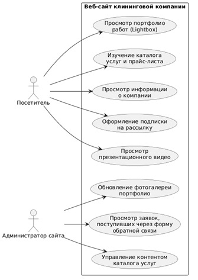
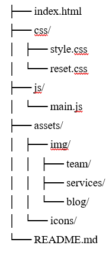
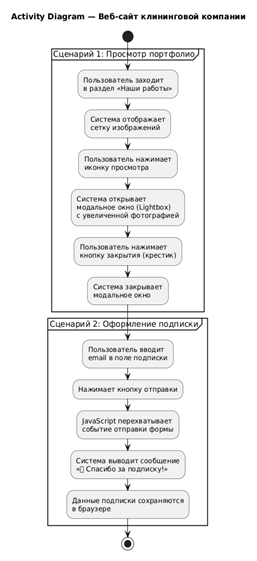
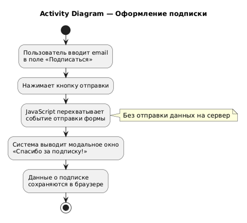
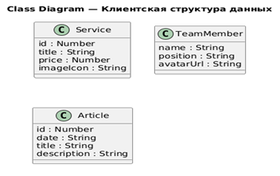

# Сайт для курсового проекта 
Созданный выше сайт был разработан в рамках выполнения курсового проекта за 1 учебный год. 
Посмотреть исходный код можно на https://github.com/JoePeach777/KleanPro
Посмотреть готовую страницу сайта можно на https://joepeach777.github.io/KleanPro/

# Техническое задание на разработку
## Основание для разработки
Основанием для разработки программного продукта - сайта (далее по тексту - Сайт) является поставленная задача в курсовом проекте по теме "Разработка веб-интерфейса для клининговой компании".

## Назначение разработки.
Сайт предназначен для удобства ознакомления с услугами клининговой компании, просмотра портфолио работ и привлечения клиентов посредством создания программного продукта и исполнения смежных процессов, оговоренных далее в ТЗ:
- предоставление актуальной информации о видах уборки, прайс-листе и преимуществах компании;
- формирование доверия через демонстрацию отзывов клиентов, состава команды и блога;
- обеспечение каналов интерактивного взаимодействия (модальные окна, форма подписки, видеоплеер).

## Предмет разработки.
Предметом разработки является многостраничное веб-приложение (Multi-Page Application), реализующее функционал Сайта клининговой организации "KleanPro".

## Процесс разработки.
Разработка Сайта включает в себя следующую последовательность действий:
- проектирование логической структуры разделов и интерактивных компонентов;
- подготовка графического и текстового контента, включая карточки услуг и статьи блога;
- семантическая вёрстка компонентов интерфейса на языке HTML;
- описание стилей и анимации взаимодействия с помощью каскадных таблиц CSS;
- реализация клиентской логики (перехват форм, модальные окна, обработка данных в браузере) на языке JavaScript;
- оптимизация производительности, тестирование и устранение ошибок интерфейса;
- адаптация веб-интерфейса для устройств с различной шириной экрана;
- составление сопроводительной документации по проделанной работе.

## Требования к размещению контента и интерактивным элементам.
Сайт реализуется по классической многостраничной архитектуре (MPA). Каждый раздел представляет собой самостоятельный HTML-документ, перемещение по сайту осуществляется посредством стандартных гиперссылок.

Обязательные элементы пользовательского интерфейса (единые для всех страниц):
1. **Шапка Сайта / Главный экран** состоит из основных частей:
   - Верхняя инфо-панель: отображает контактные данные (Email и Телефон);
   - Главное навигационное меню: обеспечивает быстрое перемещение по разделам сайта;
   - Кнопка быстрого действия: "Узнать цену".
2. **Основная область контента** представляет собой уникальную для каждой страницы смысловую часть. На главной странице размещаются:
   - Карусель баннеров и блок информации "25 лет опыта работы";
   - Информационные карточки услуг ("Уборка дома", "Мытьё окон");
   - Блок преимуществ с числовыми показателями;
   - Лента отзывов клиентов (Алексей, Сергей) и блок "Наша команда";
   - Раздел "Блог" с последними публикациями компании.
3. **Подвал Сайта (Футер)** содержит дублирующую информацию и форму подписки на рассылку.

### Сценарии работы интерактивных элементов:
- **Модальное окно "Узнать цену":** вызывается по кнопке из шапки сайта, позволяет клиенту запросить расчёт стоимости.
- **Всплывающий видео-плеер:** открывает презентационный видеоролик компании в удобном модальном окне при клике.
- **Форма подписки на рассылку:** расположена в футере. При вводе email и нажатии кнопки отправки JavaScript перехватывает событие (без отправки данных на сервер), выводит сообщение "Спасибо за подписку!", а данные о подписке локально сохраняются в хранилище браузера.
- **Просмотр портфолио (Lightbox):** при переходе в раздел выполненных работ и нажатии на иконку просмотра, система открывает модальное окно с увеличенной фотографией объекта, которое можно закрыть по клику на "крестик".

## Требования к техническим характеристикам Сайта.
- **Технологический стек:** разработка ведётся исключительно с использованием HTML5, CSS3 и нативного JavaScript (Vanilla JS), без использования сторонних фреймворков.
- **Архитектура:** Multi-Page Application (MPA). Каждая страница — это отдельный HTML-файл.
- **Организованность кода:** не допускается смешивания разметки, стилей и логики. Проект содержит чётко разделённые файлы и директории (`css/`, `js/`, `img/`, `fonts/`).
- **Обобщение кода:** стили и скрипты, отвечающие за общее оформление и сквозные элементы, вынесены в отдельные файлы и подключаются ко всем HTML-документам.

## График выполнения работ: с 02.02.2026 по 23.05.2026.
Приведённые в техническом задании требования к исполнению проекта являются обязательными для исполнения.
# Диаграммы и схемы
## Диаграммы вариантов использования

Диаграмма вариантов использования актора "Посетитель И Администратор"
___
## Иерархическая структура сайта 

___
## Диаграммы деятельности

Диаграмма деятельности "Просмотр портфолио выполненных работ"
___

Диаграмма деятельности "Cценарий оформления подписки"
___
## Диаграмма классов и сущностей

